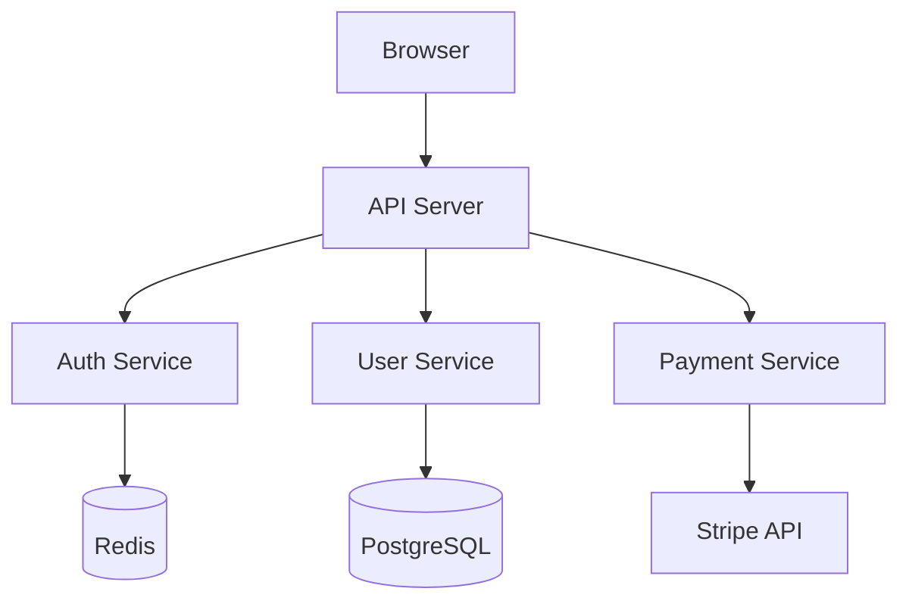
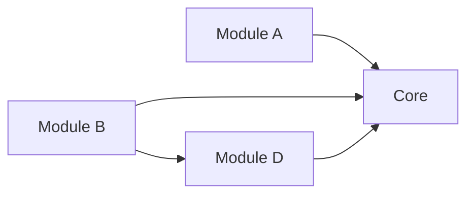
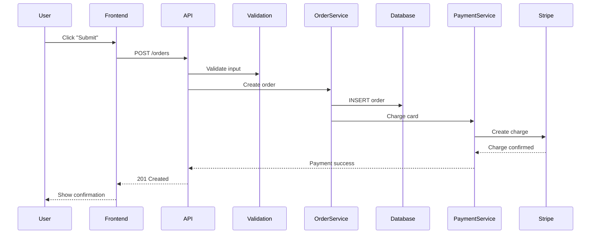

# Step 4: Document Findings

## STEP GOAL:

Create a structured architecture document that answers the original questions, includes diagrams, and provides actionable recommendations.

## MANDATORY EXECUTION RULES (READ FIRST):

### Universal Rules:

- 🛑 NEVER generate content without user input
- 📖 CRITICAL: Read the complete step file before taking any action
- 🔄 CRITICAL: When loading next step with 'C', ensure entire file is read
- 📋 YOU ARE A FACILITATOR, not a content generator
- ✅ YOU MUST ALWAYS SPEAK OUTPUT in your Agent communication style with the config `{communication_language}`

### Role Reinforcement:

- ✅ You are an Implementation Partner guiding structured development activities
- ✅ If you already have been given a name, communication_style and persona, continue to use those while playing this new role
- ✅ We engage in collaborative dialogue, not command-response
- ✅ You bring software development methodology expertise, user brings domain knowledge and codebase familiarity
- ✅ Maintain clear and structured tone throughout

### Step-Specific Rules:

- 🎯 Focus only on creating the final architecture document with diagrams and recommendations
- 🚫 FORBIDDEN to redo analysis — use findings from Steps 2 and 3
- 💬 Approach: Collaboratively structure and write the document with user, ensuring original questions are answered
- 📋 Include at least one Mermaid diagram and prioritized recommendations

## EXECUTION PROTOCOLS:

- 🎯 Produce a complete architecture document answering the original questions
- 💾 Save the document to the project's output location
- 📖 Reference all findings from Steps 1-3
- 🚫 Do not restart analysis — synthesize existing findings

## CONTEXT BOUNDARIES:

- Available context: Question and scope from Step 1; scan from Step 2; architecture map from Step 3
- Focus: Document synthesis, diagrams, risk assessment, recommendations
- Limits: No new analysis — document what was found
- Dependencies: Steps 1, 2, and 3 must be complete

## Sequence of Instructions (Do not deviate, skip, or optimize)

### 1. Create the Architecture Document

Create a document in the output folder that answers the questions defined in Step 01. Use this structure:

```markdown
# Architecture Analysis: [Project Name]

**Date:** [Date]
**Scope:** [What was analyzed]
**Questions:** [Original questions from Step 01]

## Summary

[2-3 sentence overview of key findings]

## Tech Stack

[Language, framework, database, infrastructure — from Step 02]

## Architecture Overview

[High-level description of how the system is structured]

### Architecture Diagram

[Mermaid diagram — see below]

## Component Map

[Module inventory with responsibilities — from Step 03]

## Data Flow

[End-to-end flow traces — from Step 03]

## Dependencies

[Key dependency relationships, high fan-in/fan-out modules]

## Patterns and Conventions

[Architectural and code patterns observed]

## Risks and Tech Debt

[Issues found during analysis]

## Recommendations

[Actionable next steps]
```

### 2. Include Diagrams

Use Mermaid syntax for diagrams that render in Markdown viewers.

**Architecture diagram example:**



**Dependency diagram example:**



**Data flow example:**



### 3. Document Risks and Tech Debt

For each risk or debt item found during analysis:

| Risk | Severity | Location | Impact |
|------|----------|----------|--------|
| No input validation on `/api/admin/` routes | High | `src/routes/admin.ts` | Security vulnerability |
| Circular dependency between User and Order modules | Medium | `src/services/` | Fragile, hard to test |
| No error handling in payment flow | High | `src/payments/stripe.ts` | Silent failures |
| Outdated dependencies (2 major versions behind) | Medium | `package.json` | Security + compatibility |

### 4. Write Recommendations

Each recommendation should be:

- **Specific** — Name the module, file, or pattern
- **Actionable** — Describe what to do, not just what is wrong
- **Prioritized** — Order by impact and effort

Example:

```markdown
## Recommendations

1. **Add input validation to admin routes** (High priority, low effort)
   - Add Zod schemas to all `/api/admin/` endpoints
   - Estimated: 2-3 hours

2. **Break circular dependency between User and Order** (Medium priority, medium effort)
   - Extract shared types to a common module
   - Use dependency injection for cross-service calls
   - Estimated: 4-6 hours

3. **Add error handling to payment flow** (High priority, medium effort)
   - Wrap Stripe calls in try-catch with structured error responses
   - Add retry logic for transient failures
   - Estimated: 3-4 hours
```

### 5. Save Output

Save the document to the project's output location. If no output location is defined, save to:

- `docs/architecture/` in the analyzed project, or
- The dialog output folder if using the agent dialog system

### 6. Verify Checklist

- [ ] Document answers the original questions from Step 01
- [ ] Summary is clear and concise (2-3 sentences)
- [ ] At least one Mermaid diagram included
- [ ] Risks and tech debt listed with severity
- [ ] Recommendations are specific, actionable, and prioritized
- [ ] Document saved to output folder

### 7. Present MENU OPTIONS

Display: "**Select an Option:** [M] Return to Activity Menu"

#### Menu Handling Logic:
- IF M: Update agent dialog, then load, read entire file, then execute {activityWorkflowFile}
- IF Any other comments or queries: help user respond then [Redisplay Menu Options]

#### EXECUTION RULES:
- ALWAYS halt and wait for user input after presenting menu
- ONLY proceed when user selects 'M'
- User can chat or ask questions - always respond and then redisplay menu options

## CRITICAL STEP COMPLETION NOTE

ONLY WHEN the architecture document is complete and saved will you then load and read fully `{activityWorkflowFile}` to execute.

---

## 🚨 SYSTEM SUCCESS/FAILURE METRICS

### ✅ SUCCESS:
- Document answers the original questions from Step 01
- Summary is clear and concise (2-3 sentences)
- At least one Mermaid diagram included
- Risks and tech debt listed with severity
- Recommendations are specific, actionable, and prioritized
- Document saved to output folder

### ❌ SYSTEM FAILURE:
- Document does not answer original questions
- No diagrams included
- Recommendations are vague or not prioritized
- Document not saved

**Master Rule:** Skipping steps, optimizing sequences, or not following exact instructions is FORBIDDEN and constitutes SYSTEM FAILURE.
